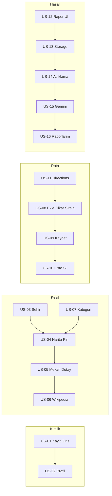

# Nomad MVP — Kullanıcı Hikayesi Bazlı Geliştirme Planı

**Kaynak:** [nomad_PRD.md](c:\FlutterBootcamp\nomad\nomad_PRD.md) Bölüm 5 (MVP), 6 (mimari), 7 (ekranlar), 8 (Edge endpoints), 9 (sprint).

**Mevcut durum:** [frontend/package.json](c:\FlutterBootcamp\nomad\frontend\package.json) — Expo ~54, Expo Router; henüz `@supabase/supabase-js`, `react-native-maps`, Google/Wikipedia/Gemini paketleri yok. Workspace’te `supabase/` klasörü yok — migration ve Edge Functions sıfırdan eklenecek.

**Ortak teknik notlar (tüm hikayeler):**

- Backend kuralları: [supabase-backend.mdc](c:\FlutterBootcamp\nomad\.cursor\rules\backend\supabase-backend.mdc) — UUID PK, **her tabloda RLS + politikalar**, API anahtarları **yalnız Edge Function** üzerinden.
- PRD şema: `users` (Supabase `auth.users` ile `public.profiles` eşlemesi yaygın pattern), `cities`, `places`, `routes`, `route_places`, `damage_reports`; rapor durumu: `bekliyor → incelendi → iletildi`.
- Mobil kod kökü: [frontend/app/](c:\FlutterBootcamp\nomad\frontend\app).

---

## US-01 — Email ve şifre ile kayıt / giriş ve Supabase Auth

**Hikaye:** Gezgin olarak kayıt olup giriş yaparak uygulamayı kişisel verilerimle kullanmak istiyorum.

**Kabul:** Email/şifre ile sign-up ve sign-in; oturum kalıcılığı; çıkış; hata mesajları (geçersiz şifre vb.).

**İşler:**

1. Supabase projesi + `supabase/` migration yapısı; `public.profiles` (ör. `id` → `auth.users`, `full_name`, `avatar_url`) ve temel RLS.
2. Frontend: `@supabase/supabase-js`, `expo-secure-store` (veya uygun Expo güvenli depolama) ile Supabase client; ortam değişkenleri (`EXPO_PUBLIC_SUPABASE_URL`, anon key).
3. Expo Router grupları: `(auth)` login/register stack ile korumalı `(app)` veya mevcut `(tabs)` — oturum yoksa auth’a yönlendirme.

**Bağımlılık:** Yok (ilk sprint).

---

## US-02 — Kullanıcı profili (isim, avatar)

**Hikaye:** Hesabımda görünen adımı ve avatarımı güncellemek istiyorum.

**Kabul:** Profil ekranında isim kaydı; avatar seçimi/yükleme → Storage bucket + `profiles.avatar_url` güncellemesi; yalnızca kendi kaydını düzenleyebilme (RLS).

**İşler:**

1. Storage bucket (ör. `avatars`), RLS politikaları.
2. UI: [PRD ekran listesi — Profil](nomad_PRD.md); profil formu + görsel seçici (`expo-image-picker`).

**Bağımlılık:** US-01.

---

## US-03 — Şehir seçme ekranı

**Hikaye:** Keşfe başlamadan önce şehir seçmek istiyorum.

**Kabul:** En az 3 şehir (demo başarı kriteri); seçim sonrası harita/keşif bağlamı şehre bağlanır; seed veya `cities` tablosundan okuma.

**İşler:**

1. Migration: `cities` tablosu + seed (İstanbul + 2 şehir daha).
2. Ekran: şehir listesi veya seçici → seçilen `city_id` global state / context / URL param.

**Bağımlılık:** US-01 isteğe bağlı (anon okuma ile şehir listesi açılabilir; tutarlılık için genelde auth sonrası).

---

## US-04 — Harita üzerinde turistik mekan pinleri (Google Maps)

**Hikaye:** Haritada seçili şehirdeki turistik yerleri pin olarak görmek istiyorum.

**Kabul:** `react-native-maps` (Expo uyumlu kurulum); `places` verisiyle pinler; konuma göre zoom/region.

**İşler:**

1. `places` migration: PRD alanları (`city_id`, `name`, `category`, `google_place_id`, `wiki_summary`, `lat`, `lng`) + RLS (ör. herkese SELECT, yazma yok veya admin).
2. Seed: şehir başına en az 5 mekan (demo kriteri).
3. Ana harita ekranı — pin render; Google Maps provider yapılandırması (API key güvenliği: mümkünse kısıtlı key, Android/iOS bundle).

**Bağımlılık:** US-03.

---

## US-05 — Mekan detay sayfası (isim, kategori, konum)

**Hikaye:** Bir pine tıklayınca mekanın temel bilgisini görmek istiyorum.

**Kabul:** İsim, kategori, koordinat/adres özeti; PRD’deki “rota ekle” için hazır CTA (US-08’de bağlanır).

**İşler:**

1. Expo Router dynamic route: örn. `place/[id].tsx`; Supabase’ten `places` okuma.

**Bağımlılık:** US-04.

---

## US-06 — Wikipedia API ile kısa bilgi özeti

**Hikaye:** Mekan hakkında kısa ansiklopedik özet görmek istiyorum.

**Kabul:** Detay ekranında özet metin; yükleme/hata durumu; PRD’ye uygun olarak özet Edge üzerinden veya doğrudan Wikipedia REST (anahtar gerektirmiyorsa) — maliyet/cache için PRD ve [supabase-backend.mdc](c:\FlutterBootcamp\nomad\.cursor\rules\backend\supabase-backend.mdc) önerisi: **Places/wiki sonuçlarını DB’de cache**.

**İşler:**

1. Edge Function: `GET /places/:id/wiki` (PRD Tablo 8); JWT doğrulama; Wikipedia fetch; isteğe bağlı `places.wiki_summary` güncelleme.
2. Mobil: detay sayfasında wiki çağrısı.

**Bağımlılık:** US-05.

---

## US-07 — Kategori filtresi (cami, müze, kale, …)

**Hikaye:** Haritada yalnız belirli kategorideki mekanları görmek istiyorum.

**Kabul:** Filtre UI; pin listesi/harita güncellenir; kategori değerleri `places.category` ile uyumlu.

**İşler:**

1. Harita ekranında chip/dropdown; client-side veya sorgu ile filtre.

**Bağımlılık:** US-04.

---

## US-08 — Mekanları rotaya ekleme / çıkarma ve rota sırasını değiştirme

**Hikaye:** Gezdiğim yerleri geçici bir rotada toplayıp sırasını düzenlemek istiyorum.

**Kabul:** Mekan detayından veya listeden ekle/çıkar; sıralama (drag veya yukarı/aşağı); oturum bazlı taslak state (henüz kaydetmeden).

**İşler:**

1. Yerel state veya geçici context; UI rota oluşturma ekranı (PRD §7).

**Bağımlılık:** US-05 (mekan kimliği).

---

## US-09 — Rotayı kaydetme ve isimlendirme

**Hikaye:** Oluşturduğum rotayı isim vererek saklamak istiyorum.

**Kabul:** `routes` + `route_places` insert; `order_index`; RLS: yalnız `user_id = auth.uid()`.

**İşler:**

1. Migration: `routes`, `route_places` + FK cascade + politikalar.
2. Modal/form: başlık (`title`), isteğe bağlı `description`.

**Bağımlılık:** US-01, US-08.

---

## US-10 — Kaydedilmiş rotaları listeleme ve silme

**Hikaye:** Daha önce kaydettiğim rotalara erişip gerektiğinde silmek istiyorum.

**Kabul:** Liste; silmede cascade veya `route_places` temizliği; boş liste durumu.

**İşler:**

1. Supabase select/delete; rota listesi ekranı.

**Bağımlılık:** US-09.

---

## US-11 — Google Maps Directions ile tahmini süre

**Hikaye:** Rotamdaki duraklar arası tahmini süreyi görmek istiyorum.

**Kabul:** Edge `GET /routes/directions` proxy (PRD); çoklu waypoint; sonuçta süre/mesafe özeti; kota için cache stratejisi dokümante.

**İşler:**

1. Edge Function: Directions API; JWT.
2. Rota ekranında “tahmini süre” gösterimi.

**Bağımlılık:** US-08 (veya US-09 kayıtlı rota açılışı).

---

## US-12 — Mekan seçerek hasar raporu oluşturma; fotoğraf çekme veya galeriden seçme

**Hikaye:** Bir tarihi mekanda gördüğüm hasarı fotoğraflayarak rapora başlamak istiyorum.

**Kabul:** Mekan seçimi (liste veya detaydan); `expo-image-picker` ile kamera/galeri; önizleme.

**İşler:**

1. Rapor oluşturma ekranı iskeleti; navigasyon parametreleri (`place_id`).

**Bağımlılık:** US-05.

---

## US-13 — Supabase Storage’a fotoğraf yükleme

**Hikaye:** Rapor fotoğrafımın güvenli şekilde bulutta saklanmasını istiyorum.

**Kabul:** Bucket (ör. `damage-photos`); path: `user_id/...`; yükleme sonrası public/signed URL `damage_reports.photo_url` için kullanılır; RLS ve Storage politikaları.

**İşler:**

1. Storage + politikalar; upload yardımcı fonksiyonu.

**Bağımlılık:** US-01, US-12.

---

## US-14 — Açıklama metin alanı

**Hikaye:** Fotoğrafa kısa açıklama eklemek istiyorum.

**Kabul:** Çok satırlı input; gönderimde `damage_reports.description` kaydı.

**İşler:**

1. Form validasyonu (minimum/maksimum karakter — ürün kararı).

**Bağımlılık:** US-12, US-13 (aynı gönderim akışında birleştirilebilir).

---

## US-15 — Gemini 2.5 Flash ile otomatik hasar analizi ve şiddet (kritik / orta / hafif)

**Hikaye:** Yüklediğim görselin otomatik analiz edilmesini ve şiddet skorunu görmek istiyorum.

**Kabul:** Edge `POST /reports/analyze`; yapılandırılmış JSON çıktı (kurallı prompt); `damage_reports.ai_analysis`, `severity`; rate limit notu (PRD §11).

**İşler:**

1. Edge Function: Gemini vision; `Deno.env` API key; JWT zorunlu.
2. Gönderim akışı: foto yükle → analyze → DB insert veya güncelleme.

**Bağımlılık:** US-13, US-14.

---

## US-16 — Kullanıcının kendi raporlarını listeleme

**Hikaye:** Gönderdiğim raporları ve durumlarını görmek istiyorum.

**Kabul:** “Raporlarım” ekranı; `damage_reports` filtre `user_id`; durum alanı (`bekliyor` vb.); liste/kart UI.

**İşler:**

1. Migration: `damage_reports` + RLS; status default `bekliyor`.
2. Liste ekranı + navigasyon.

**Bağımlılık:** US-01; rapor kaydı US-15 ile tamamlanır.

---

## Önerilen uygulama sırası (PRD 4 haftalık ile uyumlu)

| Hafta | Odak | Hikayeler |
|-----|-----|-----|
| 1 | Altyapı | US-01, US-03, US-04 (temel), şema seed |
| 2 | Keşif | US-05, US-06, US-07; Places Edge `/places/nearby` isteğe bağlı genişleme |
| 3 | Rota | US-08–US-11 |
| 4 | Hasar | US-12–US-16, Storage, Gemini, demo stabilizasyonu |

**Out of scope (PRD):** Public Dashboard ve diğer v2.0 maddeler — bu plana dahil değil.
