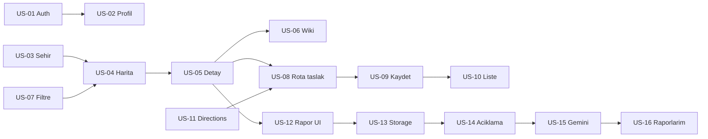

# Plan — Nomad MVP

**Kaynak:** [PRD.md](./PRD.md) Bölüm 5–9  
**Durum:** Tüm kullanıcı hikayeleri (US-01 … US-16) tamamlandı.

---

## Uygulama sırası

| Hafta | Odak | Hikayeler |
|-------|------|-----------|
| 1 | Altyapı | US-01, US-03, US-04, şema + seed |
| 2 | Keşif | US-05, US-06, US-07 |
| 3 | Rota | US-08, US-09, US-10, US-11 |
| 4 | Hasar + demo | US-12 … US-16 |

---

## Kullanıcı hikayeleri

### US-01 — Kayıt / giriş
- **Hikaye:** Gezgin olarak kayıt olup giriş yapmak istiyorum.
- **Kabul:** Email/şifre sign-up ve sign-in; oturum kalıcılığı; çıkış.
- **Teknik:** `profiles` + trigger; `AuthContext`; `(auth)` / `(main)` router grupları.
- **Durum:** Tamamlandı

### US-02 — Profil
- **Hikaye:** İsim ve avatarımı güncellemek istiyorum.
- **Teknik:** `avatars` bucket; `profile.tsx`; RLS.
- **Durum:** Tamamlandı

### US-03 — Şehir seçimi
- **Hikaye:** Keşfe başlamadan şehir seçmek istiyorum.
- **Teknik:** `cities` seed (İstanbul, Ankara, İzmir); `CityContext`; `city-select.tsx`.
- **Durum:** Tamamlandı

### US-04 — Harita pinleri
- **Hikaye:** Haritada turistik yerleri görmek istiyorum.
- **Teknik:** `places` seed (şehir başına 6 mekan); `explore.tsx` + `react-native-maps`.
- **Durum:** Tamamlandı

### US-05 — Mekan detay
- **Hikaye:** Pine tıklayınca mekan bilgisini görmek istiyorum.
- **Teknik:** `place/[id].tsx`.
- **Durum:** Tamamlandı

### US-06 — Wikipedia özeti
- **Hikaye:** Kısa ansiklopedik özet görmek istiyorum.
- **Teknik:** Edge `places-wiki`; `places.wiki_summary` cache.
- **Durum:** Tamamlandı

### US-07 — Kategori filtresi
- **Hikaye:** Yalnız belirli kategorileri görmek istiyorum.
- **Teknik:** Chip filtre; client-side `places.category`.
- **Durum:** Tamamlandı

### US-08 — Rota taslağı
- **Hikaye:** Mekanları rotada toplayıp sıralamak istiyorum.
- **Teknik:** `RouteDraftContext`; `route-builder.tsx`.
- **Durum:** Tamamlandı

### US-09 — Rotayı kaydet
- **Hikaye:** Rotayı isim vererek saklamak istiyorum.
- **Teknik:** `routes`, `route_places` insert; RLS.
- **Durum:** Tamamlandı

### US-10 — Rota listesi / sil
- **Hikaye:** Kayıtlı rotalara erişip silmek istiyorum.
- **Teknik:** `routes.tsx` tab.
- **Durum:** Tamamlandı

### US-11 — Tahmini süre
- **Hikaye:** Duraklar arası süreyi görmek istiyorum.
- **Teknik:** Edge `routes-directions`; `fetchRouteDirections` in `lib/edge.ts`.
- **Durum:** Tamamlandı

### US-12 — Rapor UI + fotoğraf
- **Hikaye:** Hasarı fotoğraflayarak rapor başlatmak istiyorum.
- **Teknik:** `report/new.tsx`; `expo-image-picker`.
- **Durum:** Tamamlandı

### US-13 — Fotoğraf storage
- **Hikaye:** Fotoğrafım güvenle saklansın.
- **Teknik:** `damage-photos` bucket; upload path `user_id/...`.
- **Durum:** Tamamlandı

### US-14 — Açıklama alanı
- **Hikaye:** Fotoğrafa açıklama eklemek istiyorum.
- **Teknik:** 10–2000 karakter validasyonu.
- **Durum:** Tamamlandı

### US-15 — Gemini analizi
- **Hikaye:** Otomatik hasar şiddeti görmek istiyorum.
- **Teknik:** Edge `reports-analyze`; enum `kritik | orta | hafif`.
- **Durum:** Tamamlandı

### US-16 — Raporlarım
- **Hikaye:** Gönderdiğim raporları listelemek istiyorum.
- **Teknik:** `reports.tsx` tab; `damage_reports` + status badge.
- **Durum:** Tamamlandı

---

## Bağımlılık diyagramı

---

## Kapsam dışı (v2.0)

- Public dashboard
- Google Places nearby search
- Push notification, sosyal özellikler, offline mod
